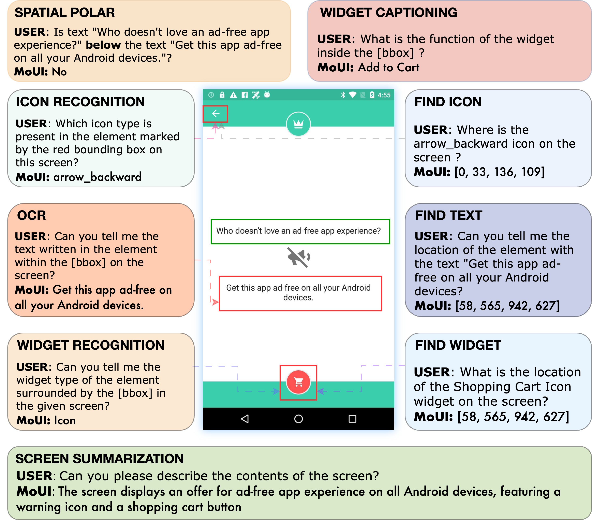
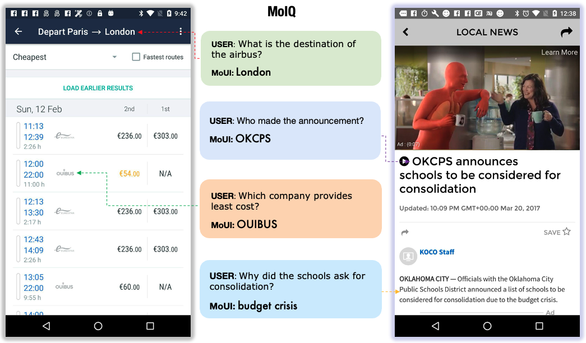
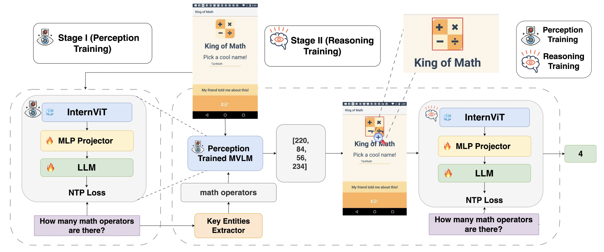

<div align="center">
    <h1>From Perception to Reasoning: Enhancing Vision-Language Models for Mobile UI Understanding</h1> 
</div>

We introduce MoUI, a series of lightweight models for understanding and grounding mobile UIs.

## Model Checkbpoints

|  Model  |                                       Checkpoint Weights                                        |
| :-----: | :---------------------------------------------------------------------------------------------: |
| MoUI-1B |  [Link](https://drive.google.com/drive/folders/19wV0SLfIPuFEVFpHighs-H7VqaFAfkvx?usp=sharing)   |
| MoUI-2B |  [Link](https://drive.google.com/drive/folders/1Datxy7ZM8dmbQ3V2m3Pz3K1xxXc9H_oY?usp=sharing)   |
| MoUI-4B | [Link](https://drive.google.com/drive/folders/1JTHV5s44sGyIGTSycR-dYcbFaMYxqT-B?usp=drive_link) |

## Introduction

Accurately grounding visual and textual elements within mobile user interfaces (UIs) remains a significant challenge for VisionLanguage Models (VLMs). Visual grounding, a critical task in this domain, involves identifying the most relevant UI element or region based on a natural language query—a process that requires both precise perception and context-aware reasoning. In this work, we present - **MoUI**, a light-weight mobile UI understanding model trained on **MoIT**, an instruction-tuning dataset specifically tailored for mobile screen understanding and grounding, designed to bridge the gap between user intent and visual semantics.

</a>

Complementing this dataset, we also present a **human-annotated reasoning benchmark MoIQ** that rigorously evaluates complex inference capabilities over mobile UIs.

</a>

To harness these resources effectively, we propose a **two-stage training pipeline** that separately addresses perception and reasoning tasks leading to stronger perception capabilities and improvement in reasoning abilities.

</a>

Through extensive experiments, we demonstrate that our MoUI models achieve significant gains in accuracy across all perception tasks and state-ofthe-art results on public reasoning benchmark ComplexQA (78%) and our MoIQ (49%).

<table border="1" cellspacing="0" cellpadding="6">
  <thead>
    <tr>
      <th><b>Model</b><br><b>Size</b></th>
      <th><b>Complex<br>ScreenQA</b></th>
      <th><b>ScreenQA<br>Short</b></th>
      <th><b>MoIQ</b></th>
    </tr>
  </thead>
  <tbody>
    <tr><td colspan="4" style="text-align: center;"><b>InternVL2.5</b></td></tr>
    <tr>
      <td>1B</td><td>0.42</td><td>0.44</td><td>0.23</td>
    </tr>
    <tr>
      <td>2B</td><td>0.49</td><td>0.52</td><td>0.26</td>
    </tr>
    <tr>
      <td>4B</td><td>0.65</td><td>0.66</td><td>0.35</td>
    </tr>
    <tr><td colspan="4" style="text-align: center;"><b>Ferret-UI-anyres</b></td></tr>
    <tr>
      <td>8B</td><td>0.29</td><td>0.49</td><td>0.29</td>
    </tr>
    <tr><td colspan="4"><b>ScreenAI</b></td></tr>
    <tr>
      <td>5B</td><td>0.43</td><td><b>0.95</b></td><td>–</td>
    </tr>
    <tr><td colspan="4" style="text-align: center;"><b>MoUI (1-stage training)</b></td></tr>
    <tr>
      <td>4B</td><td>0.74</td><td>0.83</td><td>0.42</td>
    </tr>
    <tr><td colspan="4" style="text-align: center;"><b>MoUI (2-stage training)</b></td></tr>
    <tr>
      <td>1B</td><td>0.66</td><td>0.86</td><td>0.43</td>
    </tr>
    <tr>
      <td>2B</td><td>0.67</td><td>0.86</td><td>0.43</td>
    </tr>
    <tr>
      <td>4B</td><td><b>0.78</b></td><td><b>0.89</b></td><td><b>0.49</b></td>
    </tr>
  </tbody>
</table>

## Todo

- [ ] Release code for model training.
- [x] Release the `MoIQ` evaluation benchmark.
- [ ] Release code for data generation pipeline.
- [x] Release the `MoUI` model checkpoints.
- [x] Release the `MoIT` dataset.

## Cite

```
@inproceedings{sravanthi-etal-2025-perception,
    title = "From Perception to Reasoning: Enhancing Vision-Language Models for Mobile {UI} Understanding",
    author = "Sravanthi, Settaluri Lakshmi  and
      Mishra, Ankit  and
      Mondal, Debjyoti  and
      Panda, Subhadarshi  and
      Singh, Rituraj  and
      Bhattacharyya, Pushpak",
    editor = "Che, Wanxiang  and
      Nabende, Joyce  and
      Shutova, Ekaterina  and
      Pilehvar, Mohammad Taher",
    booktitle = "Findings of the Association for Computational Linguistics: ACL 2025",
    month = jul,
    year = "2025",
    address = "Vienna, Austria",
    publisher = "Association for Computational Linguistics",
    url = "https://aclanthology.org/2025.findings-acl.1295/",
    pages = "25250--25269",
    ISBN = "979-8-89176-256-5",
}
```

## Acknowledgments

Our datasets are built on the [RICO](https://www.interactionmining.org/archive/rico) dataset.
